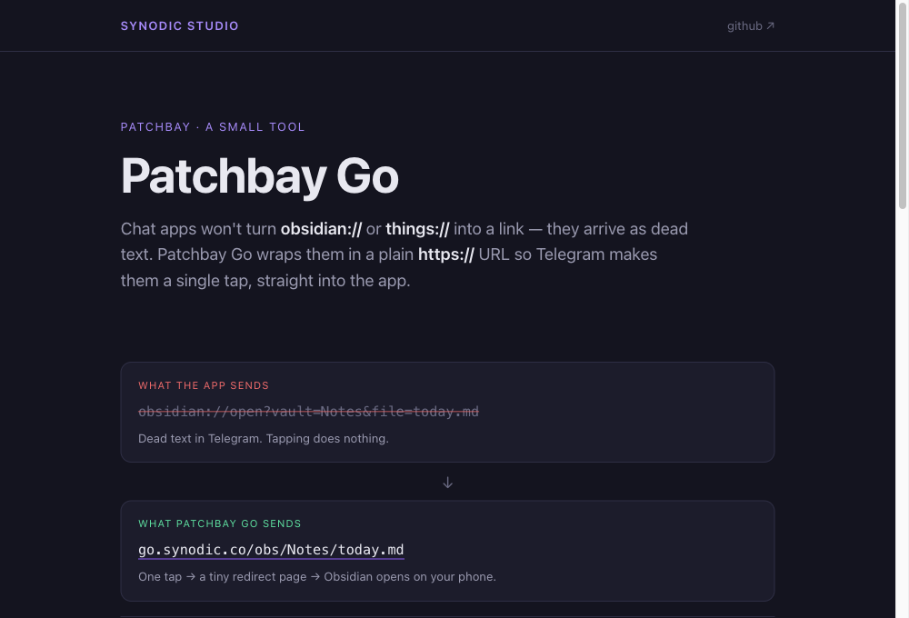
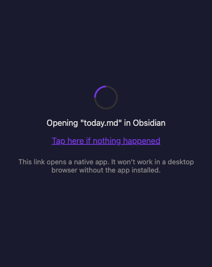
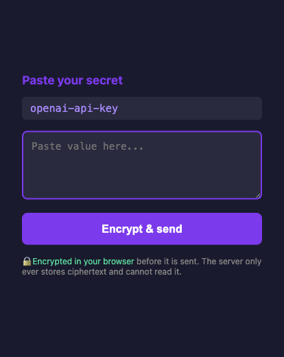

# Patchbay Go

Chat apps only linkify web links. Paste `obsidian://open?vault=Notes&file=today.md` into Telegram and it arrives as dead text. Your phone is holding a perfectly good URI it refuses to make tappable.

Patchbay Go is a tiny redirector that fixes that. Send `https://go.synodic.co/obs/Notes/today.md` instead: the chat app linkifies it, the tap opens a browser, and the browser, where custom schemes *are* allowed, hands off to `obsidian://`. One hop, a fraction of a second, and the app opens.



This is part of the Patchbay family of small tools that connect a phone chat app to a host that runs agents and apps, along with [Patchbay Relay](https://github.com/synodic-studio/patchbay-relay) and [Patchbay Voice](https://github.com/synodic-studio/patchbay-voice).

## Use it

There is nothing to install and no account to make. **`https://go.synodic.co` is live and open.** Build a URL and send it:

```
https://go.synodic.co/obs/MyVault/notes/today.md
https://go.synodic.co/things/Buy%20milk
https://go.synodic.co/cal/2026-03-14
```

Or [run your own](DEPLOYING.md), which is one file and a `wrangler` command. Then the domain is yours, the link prefix is yours, and the `/key` ciphertext sits in your own KV namespace instead of someone else's.

Worth knowing before you rely on it:

- **No auth, no logging, no state.** Every route is a pure function of the URL. The only storage anywhere is the optional KV namespace behind `/key`, and that holds ciphertext with a ten-minute TTL.
- **A wrapped link can only ever open a native app.** `/raw` refuses browser-privileged schemes, `https:` among them, so a link built by someone else cannot run in your browser.
- **The redirect is not a guarantee the app opens.** If the target app is not installed, you land on the fallback page and nothing happens. There is no error to catch: that is the platform's behavior, not the worker's.
- **Host-agnostic.** Nothing is hardcoded to a domain; a deployment serves the same routes and advertises its own hostname.

## What a tap looks like

The redirect page is the entire user-facing surface of a wrapped link: it flashes by on the way into the app, and only lingers if the app is not installed. The `/key` form is the one page that asks for input.

 

## Routes

| Route | Redirects to |
| --- | --- |
| `/obs/<vault>/<path>` | `obsidian://open?vault=<vault>&file=<path>` |
| `/remind/<title>` | `x-apple-reminderkit://REMCDReminder/<title>` |
| `/cal/<yyyy-mm-dd>` | `calshow:<epoch>` (Calendar.app) |
| `/cal/<yyyy-mm-dd>/<hh:mm>` | `calshow:<epoch>` at a specific time |
| `/raw/<base64url>` | Any **native** custom scheme (base64url-encoded full URI). Browser-privileged schemes are refused. |
| `/key/<uuid>` | Token-secured paste form (KV-backed, optional) |
| `/` | Usage page (renders the deployed hostname automatically) |

### Popular app routes

Common apps get named routes, so callers rarely need `/raw`. Each takes a single free-text value, URI-encoded for you.

| Notes | Tasks | Messaging | Profiles | Places |
| --- | --- | --- | --- | --- |
| `/bear/<title>`<br>`/drafts/<text>`<br>`/ulysses/<text>` | `/things/<title>`<br>`/todoist/<content>`<br>`/omnifocus/<name>`<br>`/due/<title>` | `/telegram/<username>`<br>`/whatsapp/<phone>` | `/twitter/<handle>`<br>`/instagram/<username>` | `/googlemaps/<query>`<br>`/waze/<address>` |

Three more take something more particular than a title. `/fantastical/<sentence>` parses a natural-language phrase, so `/fantastical/Lunch%20with%20Sam%20tomorrow%201pm` becomes an event. `/shortcuts/<name>` runs a Shortcut by name. `/zoom/<meeting-id>` joins a meeting.

Launchers take no argument at all and just open the app:

| Audio | Chat | Reading |
| --- | --- | --- |
| `/music`<br>`/podcasts`<br>`/overcast`<br>`/soundcloud` | `/slack`<br>`/discord` | `/reddit`<br>`/linkedin` |

Because the path is plain and predictable, a language model writes `go.synodic.co/things/Buy%20milk` correctly on the first try. That is the point, since agents are the main callers. The live list renders on the `/` page of any deployment; the single source of truth is `APP_ROUTES` in `src/worker.js`, and adding an app is one entry.

For any scheme not listed, base64url-encode the full URI and use `/raw`:

```
https://go.synodic.co/raw/dGhpbmdzOi8vLw       # → things:///
```

## `/key`: hand over a secret without putting it in a chat log

An agent on your machine needs an API key that is on your phone. Pasting it into the chat leaves it in the chat history forever, and every other quick way just picks a different log to leave it in.

`/key` sends you a one-time link instead. You open it, paste the secret into a small labeled form, and the page encrypts it in your browser before anything is sent. The worker stores ciphertext and holds no key that could read it. The agent decrypts on its own machine, where its private key never was anywhere else.

Full protocol, reference client, and the honest limits are in [KEY-VAULT.md](KEY-VAULT.md).

## Pointing a Patchbay host at your domain

Export the URL prefix on the host so agents pick it up:

```bash
export PATCHBAY_URL_WRAPPER="https://go.synodic.co"
```

Agent code that builds links reads this prefix and emits `${PATCHBAY_URL_WRAPPER}/obs/<vault>/<path>` instead of raw `obsidian://` URIs.

## License

MIT.
