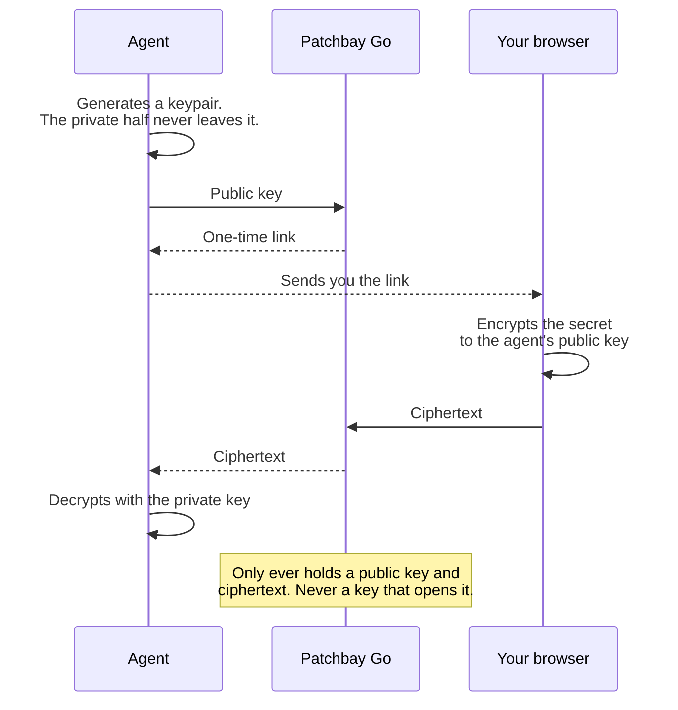

# Handing over a secret

An agent needs an API key that only you have. Every obvious way to move it is bad: pasting it into the chat puts it in the chat history forever, and mailing it to yourself just picks a different log to leave it in. `/key` is a way to hand the secret over without any intermediary ever being able to read it, including the worker doing the handing.



## How it works

The requester (an agent, a script, a person) generates an RSA-OAEP keypair and sends only the **public** half to `/key/register`, along with a label for what it is asking for. It gets back a one-time `https://<host>/key/<uuid>` link, which is safe to send through a chat app because it is useless to anyone who does not hold the matching private key.

You open the link and get a small labeled form. When you submit, the page generates a fresh AES-GCM key in your browser, encrypts the secret with it, wraps that AES key to the requester's public key, and posts the resulting envelope. The plaintext never leaves the page.

The worker stores the envelope and nothing else. It has no private key, so it cannot read what it is holding, and there is no configuration that would let it. Records carry a ten minute TTL and retrieval is one-shot: the first successful fetch deletes them.

The requester then pulls the envelope, unwraps the AES key with its private key, and decrypts. That private key never left the requester's machine.

If a `webhook` was supplied at registration, the worker fires a signed callback on submit instead of making the requester poll.

## Protocol

```
POST /key/register  {label, publicKey, webhook?}  -> {uuid, secret, url}
GET  /key/<uuid>                                  -> browser-encrypting form
POST /key/<uuid>    {envelope}                    -> stores ciphertext, fires webhook
GET  /key/<uuid>/result                           -> one-shot ciphertext retrieval
```

`publicKey` is base64 SPKI and is required. It is imported at registration, so a malformed key is rejected there rather than silently producing an envelope nobody can open. `webhook`, if present, must be https.

The `url` in the response is built from the host the registration arrived on, so a deployment on your own domain hands out links on your own domain.

## Reference client

[`clients/patchbay_key.py`](clients/patchbay_key.py) is a self-contained `uv` script that implements the requester side:

```bash
uv run clients/patchbay_key.py register my-service   # prints the tappable link
uv run clients/patchbay_key.py fetch my-service      # decrypts into `pass`
```

`register` generates the keypair, holds the private half locally at mode 0600, and prints the link. `fetch` retrieves the envelope, decrypts it, writes the secret into [`pass`](https://www.passwordstore.org/) (or prints it with `--print`), and then discards the private key. Point it at your own deployment with `PATCHBAY_HOST`.

## Enabling it

These are the only routes that need storage, so they are the only ones that need a KV namespace bound. See [Enabling `/key`](DEPLOYING.md#enabling-key) in the deployment guide. Without the binding, `/key/*` returns 400 and every other route works normally.

## Limits

The link is a bearer token for ten minutes. Anyone who intercepts it in that window can submit a secret of their choosing, which means the requester can be fed a wrong value, though never made to leak the right one.

Encryption happens in the page the worker serves, so you are trusting the deployment to serve honest JavaScript. That is an argument for [running your own](DEPLOYING.md) rather than a flaw in the scheme, and it is the reason the private key stays on the requester's machine: even a compromised page cannot reach it.
